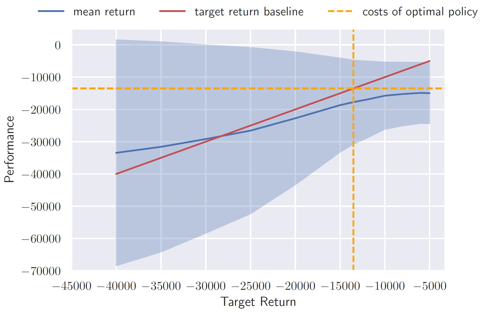
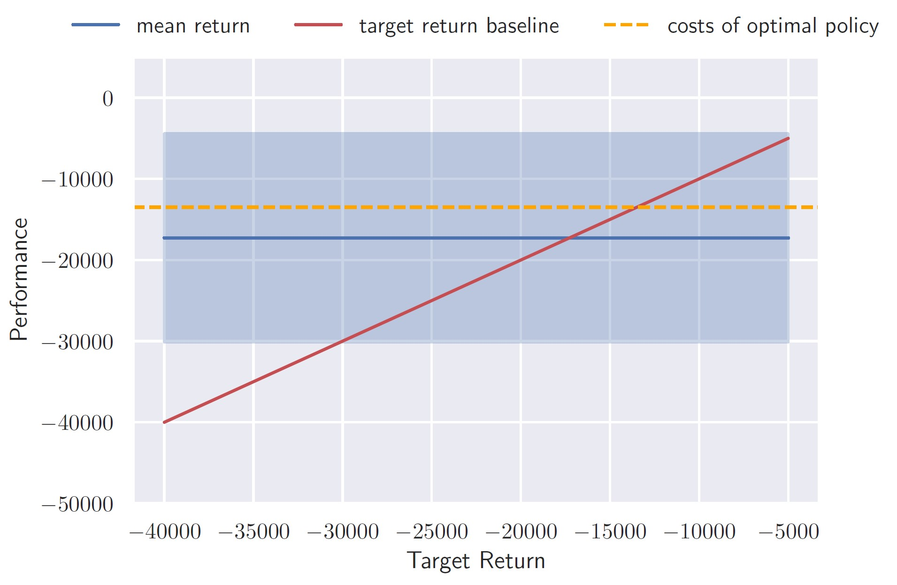

# Decision-transformers: Railway Predictive Maintenance Application

## Installation

```bash
conda create -n dt python=3.8.13
conda activate dt
pip install -r requirements.txt
```

## Background

The optimal maintenance planning problem in railway systems forms a complex sequential decision-making
problem. Maintenance actions must be selected according to the current railway condition such that the long
horizon cost objective is minimized, and the safety of the system is maintained. Reinforcement Learning (RL)
offers a strong mathematical formalism for learning-based control to solve the optimal planning task. Decision Transformer is an offline and model-free framework that casts the RL problem as a conditional sequence modeling problem. It outputs future actions by training an autoregressive model conditioned on the
past actions, states, and a desired return. In the original paper, DT was presented to have several advantages compared to conventional RL framework. Exploiting only offline datasets, we examine the applicability of DT to solve the maintenance planning problem.


## Methodology

The railway environment parameters for the transition dynamics and the observation model are already inferred in a benchmark work using real-world data. We synthetically generated offline training datasets using the inferred parameters of the environment. We examine the capability of DT to solve the maintenance planning problem by training multiple models assuming full observability, and partial observability of the environment. To observe the performance of DT models we show comparison between the DT solutions and the benchmark optimal solution for the full observability case. Despite the unavailability of a solution for the optimal policy in the partial observability setting, we derive the resulting policy constructed by a trained DT agent and draw conclusions on the DT performance. An existing challenge is that the railway environment is highly stochastic, both on the transition dynamics and the observation generating process, in contrast to the environments in the original DT paper. Furthermore, the quality of the real-world data is usually far from optimal. Hence, we examine the DT ability to extract an optimal policy from a data set that contains suboptimal trajectories.

## results

<figure>
    
    <figcaption>Performance of a model trained in an MDP setting on a dataset generated by two policies. Half of the data set is adopting a benchmark optimal policy, while the other half is generated following a random action generation policy. The red line denotes the perfect optimal performance and blue line represent the achieved return of the model given a desired return.</figcaption>
</figure>
  
<figure>
    
    <figcaption>Alignment between achieved returns and target returns in POMDP setting. The results are shown for a training data set generated following the benchmark optimal policy.</figcaption>
</figure>

## Conclusion

For the full observability use case (MDP), DT showed some drawbacks when trained on single policy. It is demonstrated that DT provides only a solution that, on average, matches the mean trajectory returns in the training data set, and fail to generalize to unseen trajectory returns, regardless of the desired return. On the other hand, DT models trained on a data set that is collected by two different policies, an optimal policy as well as a random action generation policy, showed to have a relatively better generalization ability based on the desired return values. Looking at results from experiments in the MDP setting, we might conclude that the DT model consistently provides policies that are contingent to the data set similar to behavioral cloning or imitation learning. In the partial observability case (POMDP), it was demonstrated that the results of the DT model, trained on dataset generated by optimal dataset, showed inferior performance compared to the benchmark approximate solution, i.e., objective costs, for POMDP. 

